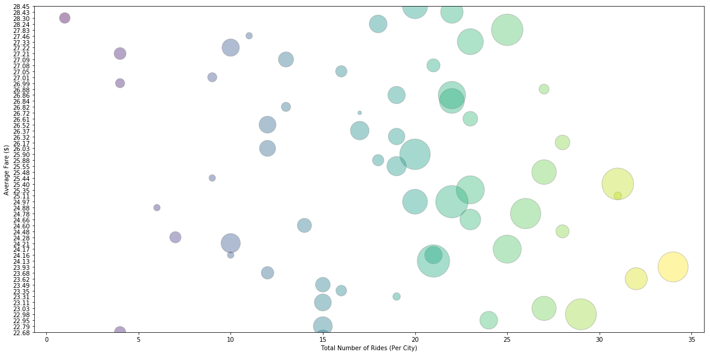

```python
# Load dependencies
import matplotlib.pyplot as plt
import pandas as pd
import numpy as np
import seaborn as sns
import os
```


```python
# Read CSV
csvpath = os.path.join('Data', 'city_data.csv')
csvpath1 = os.path.join('Data', 'ride_data.csv')
```


```python
# Create city data frame from CSV
city_data_df = pd.read_csv(csvpath)
city_data_index = city_data_df.set_index('city')
city_data_index.head(500)
```


<div>
<style scoped>
    .dataframe tbody tr th:only-of-type {
        vertical-align: middle;
    }

    .dataframe tbody tr th {
        vertical-align: top;
    }

    .dataframe thead th {
        text-align: right;
    }
</style>
<table border="1" class="dataframe">
  <thead>
    <tr style="text-align: right;">
      <th></th>
      <th>driver_count</th>
      <th>type</th>
    </tr>
    <tr>
      <th>city</th>
      <th></th>
      <th></th>
    </tr>
  </thead>
  <tbody>
    <tr>
      <th>Kelseyland</th>
      <td>63</td>
      <td>Urban</td>
    </tr>
    <tr>
      <th>Nguyenbury</th>
      <td>8</td>
      <td>Urban</td>
    </tr>
    <tr>
      <th>East Douglas</th>
      <td>12</td>
      <td>Urban</td>
    </tr>
    <tr>
      <th>West Dawnfurt</th>
      <td>34</td>
      <td>Urban</td>
    </tr>
    <tr>
      <th>Rodriguezburgh</th>
      <td>52</td>
      <td>Urban</td>
    </tr>
    <tr>
      <th>South Josephville</th>
      <td>4</td>
      <td>Urban</td>
    </tr>
    <tr>
      <th>West Sydneyhaven</th>
      <td>70</td>
      <td>Urban</td>
    </tr>
    <tr>
      <th>Travisville</th>
      <td>37</td>
      <td>Urban</td>
    </tr>
    <tr>
      <th>Torresshire</th>
      <td>70</td>
      <td>Urban</td>
    </tr>
    <tr>
      <th>Lisaville</th>
      <td>66</td>
      <td>Urban</td>
    </tr>
    <tr>
      <th>Mooreview</th>
      <td>34</td>
      <td>Urban</td>
    </tr>
    <tr>
      <th>Smithhaven</th>
      <td>67</td>
      <td>Urban</td>
    </tr>
    <tr>
      <th>Carrollfort</th>
      <td>55</td>
      <td>Urban</td>
    </tr>
    <tr>
      <th>Port Josephfurt</th>
      <td>28</td>
      <td>Urban</td>
    </tr>
    <tr>
      <th>Lake Jeffreyland</th>
      <td>15</td>
      <td>Urban</td>
    </tr>
    <tr>
      <th>South Louis</th>
      <td>12</td>
      <td>Urban</td>
    </tr>
    <tr>
      <th>West Peter</th>
      <td>61</td>
      <td>Urban</td>
    </tr>
    <tr>
      <th>Kimberlychester</th>
      <td>13</td>
      <td>Urban</td>
    </tr>
    <tr>
      <th>Alyssaberg</th>
      <td>67</td>
      <td>Urban</td>
    </tr>
    <tr>
      <th>Sarabury</th>
      <td>46</td>
      <td>Urban</td>
    </tr>
    <tr>
      <th>Yolandafurt</th>
      <td>7</td>
      <td>Urban</td>
    </tr>
    <tr>
      <th>Edwardsbury</th>
      <td>11</td>
      <td>Urban</td>
    </tr>
    <tr>
      <th>New Andreamouth</th>
      <td>42</td>
      <td>Urban</td>
    </tr>
    <tr>
      <th>New David</th>
      <td>31</td>
      <td>Urban</td>
    </tr>
    <tr>
      <th>Arnoldview</th>
      <td>41</td>
      <td>Urban</td>
    </tr>
    <tr>
      <th>Williamshire</th>
      <td>70</td>
      <td>Urban</td>
    </tr>
    <tr>
      <th>Lisatown</th>
      <td>47</td>
      <td>Urban</td>
    </tr>
    <tr>
      <th>New Aaron</th>
      <td>60</td>
      <td>Urban</td>
    </tr>
    <tr>
      <th>Swansonbury</th>
      <td>64</td>
      <td>Urban</td>
    </tr>
    <tr>
      <th>Fosterside</th>
      <td>69</td>
      <td>Urban</td>
    </tr>
    <tr>
      <th>...</th>
      <td>...</td>
      <td>...</td>
    </tr>
    <tr>
      <th>New Lynn</th>
      <td>20</td>
      <td>Suburban</td>
    </tr>
    <tr>
      <th>Port Jose</th>
      <td>11</td>
      <td>Suburban</td>
    </tr>
    <tr>
      <th>Johnland</th>
      <td>13</td>
      <td>Suburban</td>
    </tr>
    <tr>
      <th>West Tony</th>
      <td>17</td>
      <td>Suburban</td>
    </tr>
    <tr>
      <th>Port James</th>
      <td>3</td>
      <td>Suburban</td>
    </tr>
    <tr>
      <th>Campbellport</th>
      <td>26</td>
      <td>Suburban</td>
    </tr>
    <tr>
      <th>Port Guytown</th>
      <td>26</td>
      <td>Suburban</td>
    </tr>
    <tr>
      <th>Webstertown</th>
      <td>26</td>
      <td>Suburban</td>
    </tr>
    <tr>
      <th>Clarkstad</th>
      <td>21</td>
      <td>Suburban</td>
    </tr>
    <tr>
      <th>North Tracyfort</th>
      <td>18</td>
      <td>Suburban</td>
    </tr>
    <tr>
      <th>Martinmouth</th>
      <td>5</td>
      <td>Suburban</td>
    </tr>
    <tr>
      <th>New Jessicamouth</th>
      <td>22</td>
      <td>Suburban</td>
    </tr>
    <tr>
      <th>South Elizabethmouth</th>
      <td>3</td>
      <td>Rural</td>
    </tr>
    <tr>
      <th>East Troybury</th>
      <td>3</td>
      <td>Rural</td>
    </tr>
    <tr>
      <th>Kinghaven</th>
      <td>3</td>
      <td>Rural</td>
    </tr>
    <tr>
      <th>New Johnbury</th>
      <td>6</td>
      <td>Rural</td>
    </tr>
    <tr>
      <th>Erikport</th>
      <td>3</td>
      <td>Rural</td>
    </tr>
    <tr>
      <th>Jacksonfort</th>
      <td>6</td>
      <td>Rural</td>
    </tr>
    <tr>
      <th>Shelbyhaven</th>
      <td>9</td>
      <td>Rural</td>
    </tr>
    <tr>
      <th>Matthewside</th>
      <td>4</td>
      <td>Rural</td>
    </tr>
    <tr>
      <th>Kennethburgh</th>
      <td>3</td>
      <td>Rural</td>
    </tr>
    <tr>
      <th>South Joseph</th>
      <td>3</td>
      <td>Rural</td>
    </tr>
    <tr>
      <th>Manuelchester</th>
      <td>7</td>
      <td>Rural</td>
    </tr>
    <tr>
      <th>Stevensport</th>
      <td>6</td>
      <td>Rural</td>
    </tr>
    <tr>
      <th>North Whitney</th>
      <td>10</td>
      <td>Rural</td>
    </tr>
    <tr>
      <th>East Stephen</th>
      <td>6</td>
      <td>Rural</td>
    </tr>
    <tr>
      <th>East Leslie</th>
      <td>9</td>
      <td>Rural</td>
    </tr>
    <tr>
      <th>Hernandezshire</th>
      <td>10</td>
      <td>Rural</td>
    </tr>
    <tr>
      <th>Horneland</th>
      <td>8</td>
      <td>Rural</td>
    </tr>
    <tr>
      <th>West Kevintown</th>
      <td>5</td>
      <td>Rural</td>
    </tr>
  </tbody>
</table>
<p>126 rows × 2 columns</p>
</div>


```python
# Create ride data frame from CSV
ride_data_df = pd.read_csv(csvpath1)
ride_data_index = ride_data_df.set_index('date')
ride_data_index.head(1000)
```


<div>
<style scoped>
    .dataframe tbody tr th:only-of-type {
        vertical-align: middle;
    }

    .dataframe tbody tr th {
        vertical-align: top;
    }

    .dataframe thead th {
        text-align: right;
    }
</style>
<table border="1" class="dataframe">
  <thead>
    <tr style="text-align: right;">
      <th></th>
      <th>city</th>
      <th>fare</th>
      <th>ride_id</th>
    </tr>
    <tr>
      <th>date</th>
      <th></th>
      <th></th>
      <th></th>
    </tr>
  </thead>
  <tbody>
    <tr>
      <th>2016-01-16 13:49:27</th>
      <td>Sarabury</td>
      <td>38.35</td>
      <td>5403689035038</td>
    </tr>
    <tr>
      <th>2016-01-02 18:42:34</th>
      <td>South Roy</td>
      <td>17.49</td>
      <td>4036272335942</td>
    </tr>
    <tr>
      <th>2016-01-21 17:35:29</th>
      <td>Wiseborough</td>
      <td>44.18</td>
      <td>3645042422587</td>
    </tr>
    <tr>
      <th>2016-07-31 14:53:22</th>
      <td>Spencertown</td>
      <td>6.87</td>
      <td>2242596575892</td>
    </tr>
    <tr>
      <th>2016-07-09 04:42:44</th>
      <td>Nguyenbury</td>
      <td>6.28</td>
      <td>1543057793673</td>
    </tr>
    <tr>
      <th>2016-02-22 18:36:25</th>
      <td>New Jeffrey</td>
      <td>36.01</td>
      <td>9757888452346</td>
    </tr>
    <tr>
      <th>2016-06-07 02:39:58</th>
      <td>Port Johnstad</td>
      <td>17.15</td>
      <td>4352278259335</td>
    </tr>
    <tr>
      <th>2016-09-20 20:58:37</th>
      <td>Jacobfort</td>
      <td>22.98</td>
      <td>1500221409082</td>
    </tr>
    <tr>
      <th>2016-01-15 17:32:02</th>
      <td>Travisville</td>
      <td>27.39</td>
      <td>850152768361</td>
    </tr>
    <tr>
      <th>2016-11-16 07:27:00</th>
      <td>Sandymouth</td>
      <td>21.61</td>
      <td>2389035050524</td>
    </tr>
    <tr>
      <th>2016-04-11 07:20:48</th>
      <td>New Andreamouth</td>
      <td>7.72</td>
      <td>9992929847990</td>
    </tr>
    <tr>
      <th>2016-09-13 15:06:42</th>
      <td>New Christine</td>
      <td>24.89</td>
      <td>7918411468537</td>
    </tr>
    <tr>
      <th>2016-03-29 05:15:56</th>
      <td>Stewartview</td>
      <td>23.88</td>
      <td>6778235889588</td>
    </tr>
    <tr>
      <th>2016-09-05 05:20:39</th>
      <td>Rodriguezburgh</td>
      <td>4.54</td>
      <td>9650770953139</td>
    </tr>
    <tr>
      <th>2016-08-02 21:18:44</th>
      <td>West Sydneyhaven</td>
      <td>12.87</td>
      <td>7994760397230</td>
    </tr>
    <tr>
      <th>2016-07-11 18:42:11</th>
      <td>Swansonbury</td>
      <td>39.30</td>
      <td>744481862626</td>
    </tr>
    <tr>
      <th>2016-07-05 18:09:14</th>
      <td>Lisatown</td>
      <td>5.82</td>
      <td>6370359473201</td>
    </tr>
    <tr>
      <th>2016-11-03 01:03:05</th>
      <td>East Erin</td>
      <td>7.51</td>
      <td>4744239092530</td>
    </tr>
    <tr>
      <th>2016-01-06 17:11:30</th>
      <td>Port Martinberg</td>
      <td>8.66</td>
      <td>7298562820881</td>
    </tr>
    <tr>
      <th>2016-09-12 18:43:41</th>
      <td>Wiseborough</td>
      <td>26.83</td>
      <td>9304728540000</td>
    </tr>
    <tr>
      <th>2016-02-27 03:55:54</th>
      <td>Edwardsbury</td>
      <td>20.17</td>
      <td>8514523868075</td>
    </tr>
    <tr>
      <th>2016-06-12 17:01:29</th>
      <td>Jacobfort</td>
      <td>34.47</td>
      <td>4135673527977</td>
    </tr>
    <tr>
      <th>2016-03-26 12:56:57</th>
      <td>Pamelahaven</td>
      <td>36.43</td>
      <td>3015329826849</td>
    </tr>
    <tr>
      <th>2016-08-12 11:52:41</th>
      <td>Fosterside</td>
      <td>28.08</td>
      <td>133077693483</td>
    </tr>
    <tr>
      <th>2016-09-17 12:38:58</th>
      <td>Jacobfort</td>
      <td>38.25</td>
      <td>2182376146051</td>
    </tr>
    <tr>
      <th>2016-08-23 14:49:59</th>
      <td>West Sydneyhaven</td>
      <td>36.12</td>
      <td>5885997568611</td>
    </tr>
    <tr>
      <th>2016-01-16 00:33:02</th>
      <td>West Alexis</td>
      <td>26.62</td>
      <td>1574788996743</td>
    </tr>
    <tr>
      <th>2016-06-24 20:11:11</th>
      <td>Carrollfort</td>
      <td>6.45</td>
      <td>1092683495142</td>
    </tr>
    <tr>
      <th>2016-01-12 20:48:43</th>
      <td>New David</td>
      <td>38.68</td>
      <td>5229089333754</td>
    </tr>
    <tr>
      <th>2016-10-15 05:26:40</th>
      <td>Stewartview</td>
      <td>11.74</td>
      <td>8402784599831</td>
    </tr>
    <tr>
      <th>...</th>
      <td>...</td>
      <td>...</td>
      <td>...</td>
    </tr>
    <tr>
      <th>2016-02-07 02:46:18</th>
      <td>Alvarezhaven</td>
      <td>35.22</td>
      <td>5405756761666</td>
    </tr>
    <tr>
      <th>2016-09-25 07:58:14</th>
      <td>Travisville</td>
      <td>29.28</td>
      <td>4285150865112</td>
    </tr>
    <tr>
      <th>2016-10-26 07:04:44</th>
      <td>West Brittanyton</td>
      <td>11.88</td>
      <td>9060218228390</td>
    </tr>
    <tr>
      <th>2016-07-04 18:29:32</th>
      <td>Lisaville</td>
      <td>10.68</td>
      <td>1649275887436</td>
    </tr>
    <tr>
      <th>2016-10-10 19:40:36</th>
      <td>New Jeffrey</td>
      <td>25.22</td>
      <td>1807362483101</td>
    </tr>
    <tr>
      <th>2016-11-06 12:05:13</th>
      <td>Davistown</td>
      <td>11.02</td>
      <td>915124742623</td>
    </tr>
    <tr>
      <th>2016-09-29 01:55:33</th>
      <td>Nguyenbury</td>
      <td>30.59</td>
      <td>8786628417247</td>
    </tr>
    <tr>
      <th>2016-10-02 16:45:32</th>
      <td>Maryside</td>
      <td>40.34</td>
      <td>329838249932</td>
    </tr>
    <tr>
      <th>2016-03-16 07:06:53</th>
      <td>Lake Jennaton</td>
      <td>16.98</td>
      <td>1180616513497</td>
    </tr>
    <tr>
      <th>2016-09-07 22:49:20</th>
      <td>Aprilchester</td>
      <td>7.97</td>
      <td>3964680258694</td>
    </tr>
    <tr>
      <th>2016-07-13 19:19:42</th>
      <td>Stewartview</td>
      <td>9.01</td>
      <td>2316598025485</td>
    </tr>
    <tr>
      <th>2016-03-08 02:20:56</th>
      <td>Williamshire</td>
      <td>21.46</td>
      <td>6486122380796</td>
    </tr>
    <tr>
      <th>2016-09-09 06:19:28</th>
      <td>Maryside</td>
      <td>12.44</td>
      <td>4488991426164</td>
    </tr>
    <tr>
      <th>2016-01-21 01:02:02</th>
      <td>Pearsonberg</td>
      <td>16.47</td>
      <td>2935394705225</td>
    </tr>
    <tr>
      <th>2016-09-24 00:26:06</th>
      <td>West Peter</td>
      <td>26.79</td>
      <td>5252940310564</td>
    </tr>
    <tr>
      <th>2016-08-06 01:48:30</th>
      <td>Torresshire</td>
      <td>40.28</td>
      <td>2832353356811</td>
    </tr>
    <tr>
      <th>2016-06-05 11:38:16</th>
      <td>Arnoldview</td>
      <td>16.70</td>
      <td>4445586772952</td>
    </tr>
    <tr>
      <th>2016-10-31 19:39:25</th>
      <td>Russellport</td>
      <td>40.67</td>
      <td>5829276048623</td>
    </tr>
    <tr>
      <th>2016-05-10 12:33:44</th>
      <td>Lake Jennaton</td>
      <td>40.26</td>
      <td>4792723345570</td>
    </tr>
    <tr>
      <th>2016-03-22 02:47:56</th>
      <td>South Louis</td>
      <td>13.79</td>
      <td>7672523003962</td>
    </tr>
    <tr>
      <th>2016-11-07 17:55:02</th>
      <td>Port Samantha</td>
      <td>22.72</td>
      <td>8732014805174</td>
    </tr>
    <tr>
      <th>2016-09-03 08:12:49</th>
      <td>West Jefferyfurt</td>
      <td>20.26</td>
      <td>280405499023</td>
    </tr>
    <tr>
      <th>2016-08-13 01:15:02</th>
      <td>Lake Sarashire</td>
      <td>19.48</td>
      <td>2793166034832</td>
    </tr>
    <tr>
      <th>2016-04-19 14:08:11</th>
      <td>Smithhaven</td>
      <td>36.69</td>
      <td>7531013436874</td>
    </tr>
    <tr>
      <th>2016-02-11 13:05:54</th>
      <td>West Alexis</td>
      <td>26.00</td>
      <td>7290051442413</td>
    </tr>
    <tr>
      <th>2016-05-05 12:57:50</th>
      <td>Lake Sarashire</td>
      <td>32.48</td>
      <td>333747663741</td>
    </tr>
    <tr>
      <th>2016-04-11 05:27:09</th>
      <td>New Aaron</td>
      <td>18.78</td>
      <td>51186564251</td>
    </tr>
    <tr>
      <th>2016-04-15 00:27:53</th>
      <td>West Alexis</td>
      <td>21.20</td>
      <td>8481347560693</td>
    </tr>
    <tr>
      <th>2016-09-12 01:35:23</th>
      <td>Port Johnstad</td>
      <td>42.82</td>
      <td>7838555100226</td>
    </tr>
    <tr>
      <th>2016-03-11 18:01:18</th>
      <td>Carrollfort</td>
      <td>28.69</td>
      <td>5400762882534</td>
    </tr>
  </tbody>
</table>
<p>1000 rows × 3 columns</p>
</div>


```python
#Arrive at number of drivers per city
city_drivers = city_data_index['driver_count']
city_drivers
```


    city
    Kelseyland              63
    Nguyenbury               8
    East Douglas            12
    West Dawnfurt           34
    Rodriguezburgh          52
    South Josephville        4
    West Sydneyhaven        70
    Travisville             37
    Torresshire             70
    Lisaville               66
    Mooreview               34
    Smithhaven              67
    Carrollfort             55
    Port Josephfurt         28
    Lake Jeffreyland        15
    South Louis             12
    West Peter              61
    Kimberlychester         13
    Alyssaberg              67
    Sarabury                46
    Yolandafurt              7
    Edwardsbury             11
    New Andreamouth         42
    New David               31
    Arnoldview              41
    Williamshire            70
    Lisatown                47
    New Aaron               60
    Swansonbury             64
    Fosterside              69
                            ..
    New Lynn                20
    Port Jose               11
    Johnland                13
    West Tony               17
    Port James               3
    Campbellport            26
    Port Guytown            26
    Webstertown             26
    Clarkstad               21
    North Tracyfort         18
    Martinmouth              5
    New Jessicamouth        22
    South Elizabethmouth     3
    East Troybury            3
    Kinghaven                3
    New Johnbury             6
    Erikport                 3
    Jacksonfort              6
    Shelbyhaven              9
    Matthewside              4
    Kennethburgh             3
    South Joseph             3
    Manuelchester            7
    Stevensport              6
    North Whitney           10
    East Stephen             6
    East Leslie              9
    Hernandezshire          10
    Horneland                8
    West Kevintown           5
    Name: driver_count, Length: 126, dtype: int64


```python
# Arrive at the total drivers by city type
city_type = city_data_index['type'].value_counts()
city_type
```


    Urban       66
    Suburban    42
    Rural       18
    Name: type, dtype: int64


```python
# Arrive at the totals rides per city
city_rides = ride_data_index['city'].value_counts()
city_rides.head(500)
```


    Port Johnstad           34
    Swansonbury             34
    South Louis             32
    Port James              32
    Jacobfort               31
    West Peter              31
    Williamshire            31
    Alvarezhaven            31
    Arnoldview              31
    Stewartview             30
    West Brandy             30
    West Oscar              29
    Carrollfort             29
    West Dawnfurt           29
    New Andreamouth         28
    Kelseyland              28
    East Erin               28
    Lisaville               28
    New David               28
    Edwardsbury             27
    Port Samantha           27
    Sandymouth              27
    Smithhaven              27
    Sarabury                27
    Kimberlychester         27
    Spencertown             26
    Torresshire             26
    Nguyenbury              26
    Alyssaberg              26
    Lake Jennaton           25
                            ..
    Jasonfort               12
    South Joseph            12
    Clarkstad               12
    West Evan               12
    Conwaymouth             11
    East Leslie             11
    Williamchester          11
    New Michelleberg        11
    Kennethburgh            10
    East Stephen            10
    North Tracyfort         10
    North Whitney           10
    Floresberg              10
    Carrollbury             10
    Martinmouth              9
    Anitamouth               9
    Hernandezshire           9
    North Tara               9
    Erikport                 8
    West Kevintown           7
    East Troybury            7
    Shelbyhaven              6
    Kinghaven                6
    Jacksonfort              6
    South Elizabethmouth     5
    Stevensport              5
    New Johnbury             4
    Matthewside              4
    Horneland                4
    Manuelchester            1
    Name: city, Length: 125, dtype: int64


```python
city_ride = ride_data_df.set_index('city')
city_ride.head(500)

```


<div>
<style scoped>
    .dataframe tbody tr th:only-of-type {
        vertical-align: middle;
    }

    .dataframe tbody tr th {
        vertical-align: top;
    }

    .dataframe thead th {
        text-align: right;
    }
</style>
<table border="1" class="dataframe">
  <thead>
    <tr style="text-align: right;">
      <th></th>
      <th>date</th>
      <th>fare</th>
      <th>ride_id</th>
    </tr>
    <tr>
      <th>city</th>
      <th></th>
      <th></th>
      <th></th>
    </tr>
  </thead>
  <tbody>
    <tr>
      <th>Sarabury</th>
      <td>2016-01-16 13:49:27</td>
      <td>38.35</td>
      <td>5403689035038</td>
    </tr>
    <tr>
      <th>South Roy</th>
      <td>2016-01-02 18:42:34</td>
      <td>17.49</td>
      <td>4036272335942</td>
    </tr>
    <tr>
      <th>Wiseborough</th>
      <td>2016-01-21 17:35:29</td>
      <td>44.18</td>
      <td>3645042422587</td>
    </tr>
    <tr>
      <th>Spencertown</th>
      <td>2016-07-31 14:53:22</td>
      <td>6.87</td>
      <td>2242596575892</td>
    </tr>
    <tr>
      <th>Nguyenbury</th>
      <td>2016-07-09 04:42:44</td>
      <td>6.28</td>
      <td>1543057793673</td>
    </tr>
    <tr>
      <th>New Jeffrey</th>
      <td>2016-02-22 18:36:25</td>
      <td>36.01</td>
      <td>9757888452346</td>
    </tr>
    <tr>
      <th>Port Johnstad</th>
      <td>2016-06-07 02:39:58</td>
      <td>17.15</td>
      <td>4352278259335</td>
    </tr>
    <tr>
      <th>Jacobfort</th>
      <td>2016-09-20 20:58:37</td>
      <td>22.98</td>
      <td>1500221409082</td>
    </tr>
    <tr>
      <th>Travisville</th>
      <td>2016-01-15 17:32:02</td>
      <td>27.39</td>
      <td>850152768361</td>
    </tr>
    <tr>
      <th>Sandymouth</th>
      <td>2016-11-16 07:27:00</td>
      <td>21.61</td>
      <td>2389035050524</td>
    </tr>
    <tr>
      <th>New Andreamouth</th>
      <td>2016-04-11 07:20:48</td>
      <td>7.72</td>
      <td>9992929847990</td>
    </tr>
    <tr>
      <th>New Christine</th>
      <td>2016-09-13 15:06:42</td>
      <td>24.89</td>
      <td>7918411468537</td>
    </tr>
    <tr>
      <th>Stewartview</th>
      <td>2016-03-29 05:15:56</td>
      <td>23.88</td>
      <td>6778235889588</td>
    </tr>
    <tr>
      <th>Rodriguezburgh</th>
      <td>2016-09-05 05:20:39</td>
      <td>4.54</td>
      <td>9650770953139</td>
    </tr>
    <tr>
      <th>West Sydneyhaven</th>
      <td>2016-08-02 21:18:44</td>
      <td>12.87</td>
      <td>7994760397230</td>
    </tr>
    <tr>
      <th>Swansonbury</th>
      <td>2016-07-11 18:42:11</td>
      <td>39.30</td>
      <td>744481862626</td>
    </tr>
    <tr>
      <th>Lisatown</th>
      <td>2016-07-05 18:09:14</td>
      <td>5.82</td>
      <td>6370359473201</td>
    </tr>
    <tr>
      <th>East Erin</th>
      <td>2016-11-03 01:03:05</td>
      <td>7.51</td>
      <td>4744239092530</td>
    </tr>
    <tr>
      <th>Port Martinberg</th>
      <td>2016-01-06 17:11:30</td>
      <td>8.66</td>
      <td>7298562820881</td>
    </tr>
    <tr>
      <th>Wiseborough</th>
      <td>2016-09-12 18:43:41</td>
      <td>26.83</td>
      <td>9304728540000</td>
    </tr>
    <tr>
      <th>Edwardsbury</th>
      <td>2016-02-27 03:55:54</td>
      <td>20.17</td>
      <td>8514523868075</td>
    </tr>
    <tr>
      <th>Jacobfort</th>
      <td>2016-06-12 17:01:29</td>
      <td>34.47</td>
      <td>4135673527977</td>
    </tr>
    <tr>
      <th>Pamelahaven</th>
      <td>2016-03-26 12:56:57</td>
      <td>36.43</td>
      <td>3015329826849</td>
    </tr>
    <tr>
      <th>Fosterside</th>
      <td>2016-08-12 11:52:41</td>
      <td>28.08</td>
      <td>133077693483</td>
    </tr>
    <tr>
      <th>Jacobfort</th>
      <td>2016-09-17 12:38:58</td>
      <td>38.25</td>
      <td>2182376146051</td>
    </tr>
    <tr>
      <th>West Sydneyhaven</th>
      <td>2016-08-23 14:49:59</td>
      <td>36.12</td>
      <td>5885997568611</td>
    </tr>
    <tr>
      <th>West Alexis</th>
      <td>2016-01-16 00:33:02</td>
      <td>26.62</td>
      <td>1574788996743</td>
    </tr>
    <tr>
      <th>Carrollfort</th>
      <td>2016-06-24 20:11:11</td>
      <td>6.45</td>
      <td>1092683495142</td>
    </tr>
    <tr>
      <th>New David</th>
      <td>2016-01-12 20:48:43</td>
      <td>38.68</td>
      <td>5229089333754</td>
    </tr>
    <tr>
      <th>Stewartview</th>
      <td>2016-10-15 05:26:40</td>
      <td>11.74</td>
      <td>8402784599831</td>
    </tr>
    <tr>
      <th>...</th>
      <td>...</td>
      <td>...</td>
      <td>...</td>
    </tr>
    <tr>
      <th>New Aaron</th>
      <td>2016-10-11 02:49:17</td>
      <td>13.03</td>
      <td>6751552391576</td>
    </tr>
    <tr>
      <th>Nguyenbury</th>
      <td>2016-08-07 23:33:46</td>
      <td>32.21</td>
      <td>3306944846771</td>
    </tr>
    <tr>
      <th>Sarabury</th>
      <td>2016-08-14 19:56:59</td>
      <td>7.83</td>
      <td>4979570237054</td>
    </tr>
    <tr>
      <th>Swansonbury</th>
      <td>2016-11-22 10:34:09</td>
      <td>33.17</td>
      <td>4966554636637</td>
    </tr>
    <tr>
      <th>Kelseyland</th>
      <td>2016-01-25 08:47:09</td>
      <td>9.29</td>
      <td>213692794373</td>
    </tr>
    <tr>
      <th>West Dawnfurt</th>
      <td>2016-03-30 02:38:55</td>
      <td>43.05</td>
      <td>8265937444583</td>
    </tr>
    <tr>
      <th>Swansonbury</th>
      <td>2016-10-09 04:32:33</td>
      <td>42.58</td>
      <td>494544036029</td>
    </tr>
    <tr>
      <th>Port Samantha</th>
      <td>2016-06-15 20:23:39</td>
      <td>29.34</td>
      <td>7026936414899</td>
    </tr>
    <tr>
      <th>Lake Stevenbury</th>
      <td>2016-03-11 00:39:53</td>
      <td>17.65</td>
      <td>5215103205817</td>
    </tr>
    <tr>
      <th>Carrollfort</th>
      <td>2016-01-13 00:26:03</td>
      <td>44.75</td>
      <td>516842542795</td>
    </tr>
    <tr>
      <th>New Maryport</th>
      <td>2016-09-13 09:09:38</td>
      <td>40.93</td>
      <td>4388904712547</td>
    </tr>
    <tr>
      <th>Swansonbury</th>
      <td>2016-09-10 13:14:30</td>
      <td>28.62</td>
      <td>4568965434125</td>
    </tr>
    <tr>
      <th>Nguyenbury</th>
      <td>2016-09-20 10:38:34</td>
      <td>42.50</td>
      <td>8781676059272</td>
    </tr>
    <tr>
      <th>East Erin</th>
      <td>2016-09-28 07:41:35</td>
      <td>33.50</td>
      <td>824912536965</td>
    </tr>
    <tr>
      <th>Alyssaberg</th>
      <td>2016-07-21 13:43:26</td>
      <td>18.02</td>
      <td>5824050806642</td>
    </tr>
    <tr>
      <th>West Peter</th>
      <td>2016-08-01 23:45:37</td>
      <td>19.16</td>
      <td>2871298258217</td>
    </tr>
    <tr>
      <th>Alvarezhaven</th>
      <td>2016-05-26 11:36:48</td>
      <td>39.28</td>
      <td>8878745717970</td>
    </tr>
    <tr>
      <th>Travisville</th>
      <td>2016-08-06 13:51:35</td>
      <td>9.49</td>
      <td>354900510092</td>
    </tr>
    <tr>
      <th>Stewartview</th>
      <td>2016-04-08 09:00:30</td>
      <td>17.49</td>
      <td>2596893152844</td>
    </tr>
    <tr>
      <th>Wiseborough</th>
      <td>2016-04-16 02:07:17</td>
      <td>20.76</td>
      <td>524254681858</td>
    </tr>
    <tr>
      <th>Zimmermanmouth</th>
      <td>2016-08-09 04:35:39</td>
      <td>26.63</td>
      <td>2326214075695</td>
    </tr>
    <tr>
      <th>Spencertown</th>
      <td>2016-01-05 03:19:07</td>
      <td>34.86</td>
      <td>6293710331593</td>
    </tr>
    <tr>
      <th>West Brittanyton</th>
      <td>2016-08-09 07:46:09</td>
      <td>19.17</td>
      <td>5490192891862</td>
    </tr>
    <tr>
      <th>Torresshire</th>
      <td>2016-03-10 09:11:07</td>
      <td>16.70</td>
      <td>2989848047294</td>
    </tr>
    <tr>
      <th>Wiseborough</th>
      <td>2016-02-20 05:53:20</td>
      <td>43.92</td>
      <td>7954163272527</td>
    </tr>
    <tr>
      <th>Travisville</th>
      <td>2016-10-11 01:02:18</td>
      <td>43.96</td>
      <td>1077877764402</td>
    </tr>
    <tr>
      <th>Kimberlychester</th>
      <td>2016-07-26 01:07:55</td>
      <td>30.08</td>
      <td>831715129317</td>
    </tr>
    <tr>
      <th>Russellport</th>
      <td>2016-01-04 08:24:03</td>
      <td>26.01</td>
      <td>1076650346019</td>
    </tr>
    <tr>
      <th>Lake Stevenbury</th>
      <td>2016-08-24 13:41:42</td>
      <td>20.71</td>
      <td>5035969778276</td>
    </tr>
    <tr>
      <th>South Josephville</th>
      <td>2016-08-31 04:27:36</td>
      <td>32.65</td>
      <td>2481086332724</td>
    </tr>
  </tbody>
</table>
<p>500 rows × 3 columns</p>
</div>


```python
#Arrive at the average fare per city
average_fare = city_ride.groupby('city').mean()
average_fare = average_fare.drop('ride_id',1)
average_fare['fare'] = average_fare['fare'].map("{:,.2f}".format)
average_fare
```


<div>
<style scoped>
    .dataframe tbody tr th:only-of-type {
        vertical-align: middle;
    }

    .dataframe tbody tr th {
        vertical-align: top;
    }

    .dataframe thead th {
        text-align: right;
    }
</style>
<table border="1" class="dataframe">
  <thead>
    <tr style="text-align: right;">
      <th></th>
      <th>fare</th>
    </tr>
    <tr>
      <th>city</th>
      <th></th>
    </tr>
  </thead>
  <tbody>
    <tr>
      <th>Alvarezhaven</th>
      <td>23.93</td>
    </tr>
    <tr>
      <th>Alyssaberg</th>
      <td>20.61</td>
    </tr>
    <tr>
      <th>Anitamouth</th>
      <td>37.32</td>
    </tr>
    <tr>
      <th>Antoniomouth</th>
      <td>23.62</td>
    </tr>
    <tr>
      <th>Aprilchester</th>
      <td>21.98</td>
    </tr>
    <tr>
      <th>Arnoldview</th>
      <td>25.11</td>
    </tr>
    <tr>
      <th>Campbellport</th>
      <td>33.71</td>
    </tr>
    <tr>
      <th>Carrollbury</th>
      <td>36.61</td>
    </tr>
    <tr>
      <th>Carrollfort</th>
      <td>25.40</td>
    </tr>
    <tr>
      <th>Clarkstad</th>
      <td>31.05</td>
    </tr>
    <tr>
      <th>Conwaymouth</th>
      <td>34.59</td>
    </tr>
    <tr>
      <th>Davidtown</th>
      <td>22.98</td>
    </tr>
    <tr>
      <th>Davistown</th>
      <td>21.50</td>
    </tr>
    <tr>
      <th>East Cherylfurt</th>
      <td>31.42</td>
    </tr>
    <tr>
      <th>East Douglas</th>
      <td>26.17</td>
    </tr>
    <tr>
      <th>East Erin</th>
      <td>24.48</td>
    </tr>
    <tr>
      <th>East Jenniferchester</th>
      <td>32.60</td>
    </tr>
    <tr>
      <th>East Leslie</th>
      <td>33.66</td>
    </tr>
    <tr>
      <th>East Stephen</th>
      <td>39.05</td>
    </tr>
    <tr>
      <th>East Troybury</th>
      <td>33.24</td>
    </tr>
    <tr>
      <th>Edwardsbury</th>
      <td>26.88</td>
    </tr>
    <tr>
      <th>Erikport</th>
      <td>30.04</td>
    </tr>
    <tr>
      <th>Eriktown</th>
      <td>25.48</td>
    </tr>
    <tr>
      <th>Floresberg</th>
      <td>32.31</td>
    </tr>
    <tr>
      <th>Fosterside</th>
      <td>23.03</td>
    </tr>
    <tr>
      <th>Hernandezshire</th>
      <td>32.00</td>
    </tr>
    <tr>
      <th>Horneland</th>
      <td>21.48</td>
    </tr>
    <tr>
      <th>Jacksonfort</th>
      <td>32.01</td>
    </tr>
    <tr>
      <th>Jacobfort</th>
      <td>24.78</td>
    </tr>
    <tr>
      <th>Jasonfort</th>
      <td>27.83</td>
    </tr>
    <tr>
      <th>...</th>
      <td>...</td>
    </tr>
    <tr>
      <th>South Roy</th>
      <td>26.03</td>
    </tr>
    <tr>
      <th>South Shannonborough</th>
      <td>26.52</td>
    </tr>
    <tr>
      <th>Spencertown</th>
      <td>23.68</td>
    </tr>
    <tr>
      <th>Stevensport</th>
      <td>31.95</td>
    </tr>
    <tr>
      <th>Stewartview</th>
      <td>21.61</td>
    </tr>
    <tr>
      <th>Swansonbury</th>
      <td>27.46</td>
    </tr>
    <tr>
      <th>Thomastown</th>
      <td>30.31</td>
    </tr>
    <tr>
      <th>Tiffanyton</th>
      <td>28.51</td>
    </tr>
    <tr>
      <th>Torresshire</th>
      <td>24.21</td>
    </tr>
    <tr>
      <th>Travisville</th>
      <td>27.22</td>
    </tr>
    <tr>
      <th>Vickimouth</th>
      <td>21.47</td>
    </tr>
    <tr>
      <th>Webstertown</th>
      <td>29.72</td>
    </tr>
    <tr>
      <th>West Alexis</th>
      <td>19.52</td>
    </tr>
    <tr>
      <th>West Brandy</th>
      <td>24.16</td>
    </tr>
    <tr>
      <th>West Brittanyton</th>
      <td>25.44</td>
    </tr>
    <tr>
      <th>West Dawnfurt</th>
      <td>22.33</td>
    </tr>
    <tr>
      <th>West Evan</th>
      <td>27.01</td>
    </tr>
    <tr>
      <th>West Jefferyfurt</th>
      <td>21.07</td>
    </tr>
    <tr>
      <th>West Kevintown</th>
      <td>21.53</td>
    </tr>
    <tr>
      <th>West Oscar</th>
      <td>24.28</td>
    </tr>
    <tr>
      <th>West Pamelaborough</th>
      <td>33.80</td>
    </tr>
    <tr>
      <th>West Paulport</th>
      <td>33.28</td>
    </tr>
    <tr>
      <th>West Peter</th>
      <td>24.88</td>
    </tr>
    <tr>
      <th>West Sydneyhaven</th>
      <td>22.37</td>
    </tr>
    <tr>
      <th>West Tony</th>
      <td>29.61</td>
    </tr>
    <tr>
      <th>Williamchester</th>
      <td>34.28</td>
    </tr>
    <tr>
      <th>Williamshire</th>
      <td>26.99</td>
    </tr>
    <tr>
      <th>Wiseborough</th>
      <td>22.68</td>
    </tr>
    <tr>
      <th>Yolandafurt</th>
      <td>27.21</td>
    </tr>
    <tr>
      <th>Zimmermanmouth</th>
      <td>28.30</td>
    </tr>
  </tbody>
</table>
<p>125 rows × 1 columns</p>
</div>


```python
# Assign plot variables to each element of the Bubble plot
x = city_rides
y = average_fare
z = city_drivers
w = city_type

```


```python
ax = plt.gca()
```


```python
#plt.yticks(20,30, 2)
plt.figure(figsize = (20,10))
plt.ylim(15,70)
plt.scatter(x,y, s=z*40, c=x,  alpha=.4, edgecolors="grey")
plt.ylabel("Average Fare ($)")
plt.xlabel("Total Number of Rides (Per City)")
plt.legend()
plt.show()
```





```python
#Merge data frames into a single data frame
combined_data = pd.merge(city_data_df, ride_data_df, on = "city")
combined_data = combined_data.set_index("city")
```


```python
fare_by_type = combined_data.groupby('type')
fare_by_type
```


    <pandas.core.groupby.DataFrameGroupBy object at 0x00000253A345D710>


```python
#Arrive at the revenue per city type
sum_fares_by_type = fare_by_type['fare'].sum()
sum_fares_by_type
```


    type
    Rural        4255.09
    Suburban    20335.69
    Urban       40078.34
    Name: fare, dtype: float64


```python
# Arrive at total revenue for all city types
total_fare_revenue= combined_data["fare"].sum()
total_fare_revenue
```


    64669.119999999995


```python
#Arrive at rural fare percentage
rural_fare_percentage = (sum_fares_by_type[0] / total_fare) * 100
rural_fare_percentage
```


    ---------------------------------------------------------------------------

    NameError                                 Traceback (most recent call last)

    <ipython-input-16-4e1f96a6c74d> in <module>()
          1 #Arrive at rural fare percentage
    ----> 2 rural_fare_percentage = (sum_fares_by_type[0] / total_fare) * 100
          3 rural_fare_percentage
    

    NameError: name 'total_fare' is not defined


```python
#Arrive at suburban fare percentage
suburban_fare_percentage = (sum_fares_by_type[1] / total_fare) * 100
suburban_fare_percentage
```


```python
#Arrive at urban fare percentage
urban_fare_percentage = (sum_fares_by_type[2] / total_fare) * 100
urban_fare_percentage
```


```python
# Create definition to support creation of pie chart
labels = ["Rural", "Suburban", "Urban"]
fare_percentages = [rural_fare_percentage,suburban_fare_percentage,urban_fare_percentage]
colors = ["gold", "lightskyblue", "lightcoral"]
explode = (0,0,0.1)
```


```python
# Create fare percentage plot object
plt.pie(fare_percentages, explode=explode, labels=labels, colors=colors,
        autopct="%1.1f%%", shadow=True, startangle=140)
```


```python
plt.axis("equal")
```


```python
plt.title('Fares by City Type')
plt.legend()
```


```python
plt.show()
```


```python
#Arrive at ride by city type
ride_type_combined = combined_data["type"].value_counts()
ride_type_combined
```


```python
#Arrive at total rides for all types
total_ride_type_combined = ride_type_combined.sum()
total_ride_type_combined
```


```python
#Arrive at percentage of rides that were Urban type
urban_ride_percentage = (ride_type_combined[0] / total_ride_type_combined) * 100
urban_ride_percentage
```


```python
#Arrive at percentage of rides that were Suburban type
suburban_ride_percentage = (ride_type_combined[1] / total_ride_type_combined) * 100
suburban_ride_percentage
```


```python
#Arrive at percentage of rides that were Rural type
rural_ride_percentage = (ride_type_combined[2] / total_ride_type_combined) * 100
rural_ride_percentage
```


```python
#Create plot configuration to support pie plot
labels = ["Urban", "Suburban", "Rural"]
ride_percentages = [urban_ride_percentage,suburban_ride_percentage,rural_ride_percentage]
colors = ["lightcoral", "lightskyblue", "gold"]
explode = (.1,0,0)
```


```python
#Create pie plot object
plt.pie(ride_percentages, explode=explode, labels=labels, colors=colors,
        autopct="%1.1f%%", shadow=True, startangle=140)
```


```python
plt.axis("equal")
```


```python
plt.title('Rides by City Type')
plt.legend()
```


```python
plt.show()
```


```python
# Create data frame for driver by city type
driver_city_type = city_data_df.set_index('type')
driver_city_type = driver_city_type.drop('city',1)
driver_city_type = driver_city_type.groupby('type').sum()
driver_city_type

```


```python
#Arrive at total for all drivers by city type
sum_of_driver_type = driver_city_type.sum()
sum_of_driver_type
```


```python
#Arrive at percentage for rural drivers by city type
rural_driver_type_percentage = (driver_city_type.driver_count[0]/sum_of_driver_type) * 100
rural_driver_type_percentage = rural_driver_type_percentage[0]
rural_driver_type_percentage
```


```python
#Arrive at percentage for suburban drivers by city type
suburban_driver_type_percentage = (driver_city_type.driver_count[1]/sum_of_driver_type) * 100
suburban_driver_type_percentage = suburban_driver_type_percentage[0]
suburban_driver_type_percentage
```


```python
#Arrive at percentage for urban drivers by city type
urban_driver_type_percentage = (driver_city_type.driver_count[2]/sum_of_driver_type) * 100
urban_driver_type_percentage = urban_driver_type_percentage[0]
urban_driver_type_percentage
```


```python
#Create pie configuration to support creation of pie chart
labels = ["Urban", "Suburban", "Rural"]
driver_percentages = [urban_driver_type_percentage,suburban_driver_type_percentage,rural_driver_type_percentage]
colors = ["lightcoral", "lightskyblue", "gold"]
explode = (.1,0,0)
```


```python
#Create pie object
plt.pie(driver_percentages, explode=explode, labels=labels, colors=colors,
        autopct="%1.1f%%", shadow=True, startangle=140)
```


```python
plt.axis("equal")
```


```python
plt.title('Drivers by City Type')
plt.legend()
```


```python
plt.show()
```
